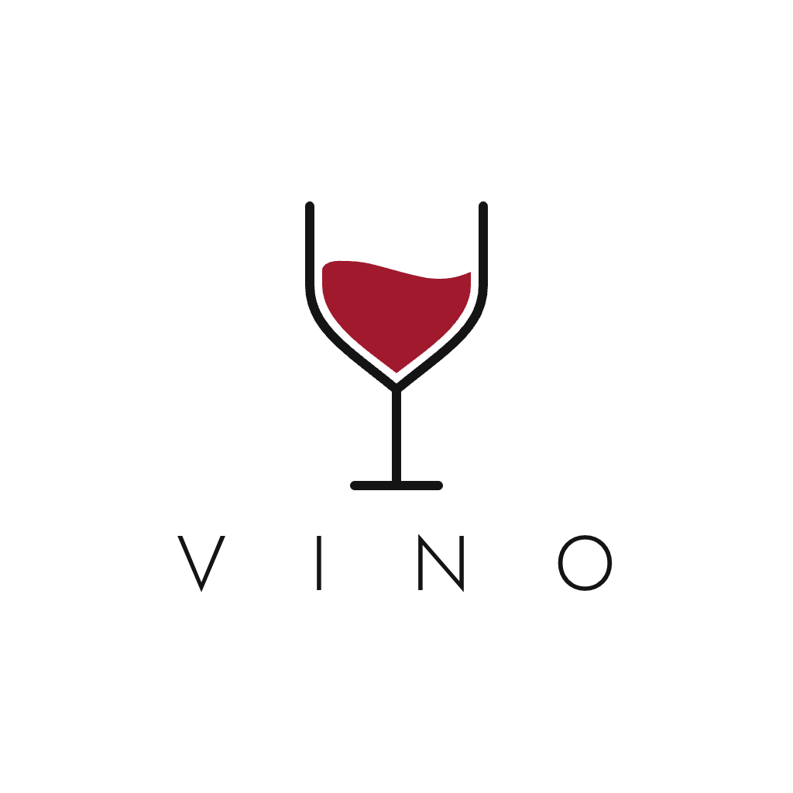

<p align="center">
  <picture>
    <source media="(prefers-color-scheme: dark)" srcset="assets/brand/vino-glass-full-dark-transparent.png">
    
  </picture>
</p>

# Vino

Vino is a Rhino 8 and Grasshopper orchestration layer for running several
persistent Codex work sessions against one active document pair. AgentHost-side
state reads and planning may overlap; calls into the Rhino/Grasshopper UI
document are serialized, and all live writes pass through a deterministic
single-writer broker with target checks, conflict detection, verification, and
managed history.

> [!IMPORTANT]
> Vino is under active development. Do not use it on irreplaceable production
> files without a verified baseline and backup.

## Design goals

- One Vino runtime per Rhino/Grasshopper file pair.
- Persistent, independently ordered Codex sessions.
- Parallel AgentHost reads and analysis with serialized live document access.
- Fast typed operations and a high-assurance path for complex work.
- No user-managed Wireify or Cordyceps ports in the normal path.
- Git-backed text history without copying `.3dm` or `.gh` binaries.
- One package containing the Rhino plugin, Grasshopper bridge, AgentHost,
  panel assets, and terminal client.

## Repository layout

```text
src/        .NET projects for contracts, host, bridge, history, and terminal
ui/panel/   React panel rendered inside Rhino's Eto WebView
tests/      Unit, integration, and routing replay tests
tools/      Fixed-command verification, smoke bridge, and live E2E harnesses
packaging/  Yak package inputs
references/ Pinned metadata for upstream design references
scripts/    Reproducible developer tooling
```

Pinned source trees are fetched into the ignored `.references/` directory.
Vino does not track those repositories as remotes or merge them automatically.

## Prerequisites

- Windows x64 and Rhino 8.21+
- .NET SDK 8
- Node.js 24 for panel development and packaging
- Codex CLI 0.144.6 (validated) or a protocol-compatible newer version

## Development

```powershell
./scripts/fetch-references.ps1
Set-Location ui/panel
npm ci
npm run test
npm run build
Set-Location ../..

dotnet restore Vino.sln
dotnet build Vino.sln -c Release
dotnet test Vino.sln -c Release --no-build
```

A model response is never a commit signal: only executor verification can mark
a change successful.

See [installation](docs/installation.md) for the single-package user workflow and
[development and packaging](docs/development.md) for reproducible build, staging,
and live Rhino validation instructions. The runtime design is in
[architecture](docs/architecture.md), and the exact model-to-broker boundary is
in the [typed operation contract](docs/operation-contract.md).

## License

Vino is licensed under Apache-2.0. See [LICENSE](LICENSE), [NOTICE](NOTICE),
and [THIRD_PARTY_NOTICES](THIRD_PARTY_NOTICES).
